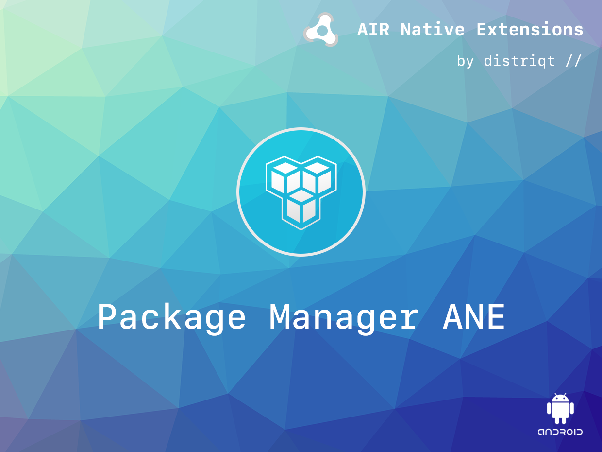
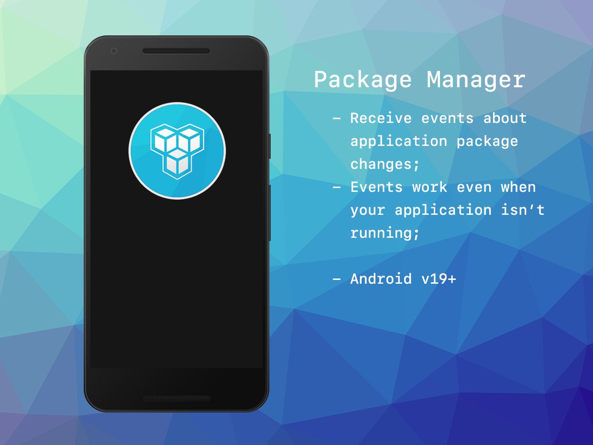

built by [distriqt //](https://airnativeextensions.com) 



# PackageManager

PackageManager is an AIR Native Extension to access certain features of the Android package manager. 


### Features

- Receive package added and removed events when other applications are installed or removed from the device
- Single API interface - your code works across supported platforms with no modifications
- Sample project code and ASDocs reference


## Documentation

Latest documentation can be found in the [wiki](https://github.com/distriqt/ANE-PackageManager/wiki)

Quick Example: 

```as3
PackageManager.service.addEventListener( PackageManagerEvent.PACKAGE_REMOVED, packageRemovedHandler );
		
function packageRemovedHandler( event:PackageManagerEvent ):void
{
	trace( "Package Removed::"+ event.packageName );
}
```


More information here: 

[com.distriqt.PackageManager](https://airnativeextensions.com/extension/com.distriqt.PackageManager)


## License

You can purchase a license for using this extension:

[airnativeextensions.com](https://airnativeextensions.com/)

distriqt retains all copyright.





