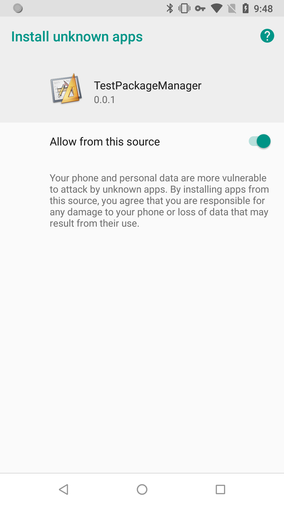

## Installing Applications

**Android only**


Remember that [Play policies](https://play.google.com/about/developer-content-policy/) still apply to apps distributed on Google Play if those apps can install and update other apps. 
In the majority of cases, such behavior is inappropriate; you should instead provide a [deep link](https://developer.android.com/distribute/marketing-tools/linking-to-google-play.html) to the app's listing on the Play Store.


### Manifest Additions


If an app uses a targetSdkLevel of 26 or above and prompts the user to install other apps, the manifest file needs to include the `REQUEST_INSTALL_PACKAGES` permission.

Apps that haven't declared this permission cannot install other apps, a handy security protection for apps that have no intention of doing so.


```xml
<uses-permission android:name="android.permission.REQUEST_INSTALL_PACKAGES" />
```


In order to correctly access the APK file you will also need to add the following file provider to the manifest **inside the `application` tag**:

```xml
<provider
    android:name="com.distriqt.extension.packagemanager.content.PackageManagerFileProvider"
    android:authorities="APPLICATION_PACKAGE.packagemanagerfileprovider"
    android:grantUriPermissions="true"
    android:exported="false">
    <meta-data
        android:name="android.support.FILE_PROVIDER_PATHS"
        android:resource="@xml/distriqt_packagemanager_paths" />
</provider>
```


### Availability

You can check whether the current device can install applications by checking the `canRequestApplicationInstalls` flag:

```as3
if (PackageManager.service.canRequestApplicationInstalls)
{
    // Can install applications
}
```


### Settings

You can redirect the user to the appropriate settings by calling `showManageUnknownAppSourcesSettings()`:

```as3
PackageManager.service.showManageUnknownAppSourcesSettings();
```

This will redirect the user to the application settings screen similar to the following:



On older versions of Android it will redirect to the generic unknown sources settings screen.


### Install

To install an application use the `installApplication()` method and pass the native path to an APK file:

```as3
var apkFile:File = File.applicationStorageDirectory.resolvePath( "Main.apk" );

PackageManager.service.installApplication( apkFile.nativePath );
```


